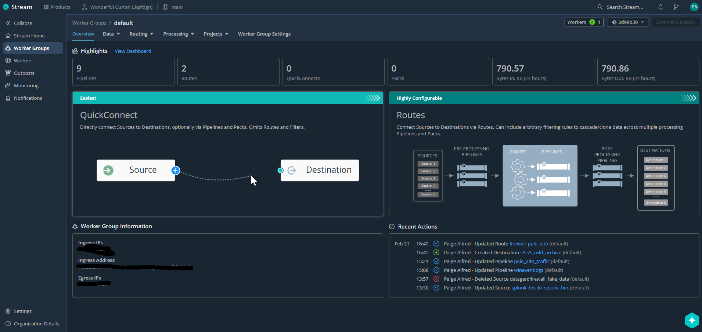
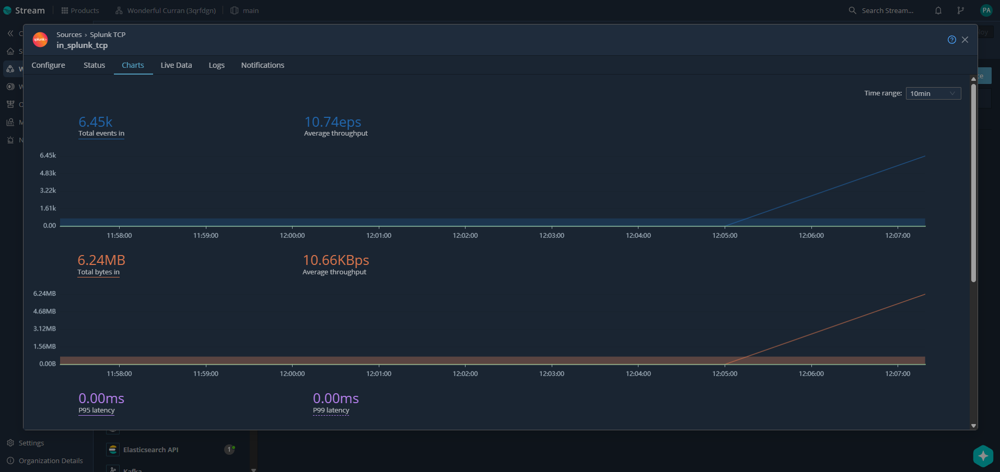
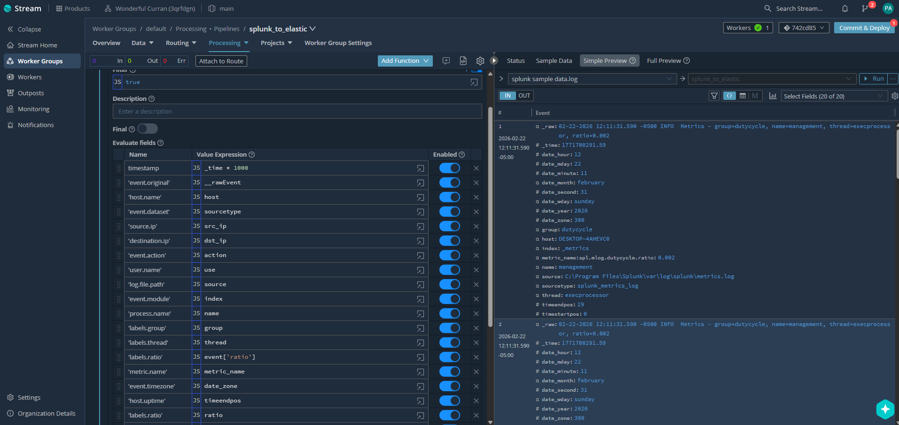
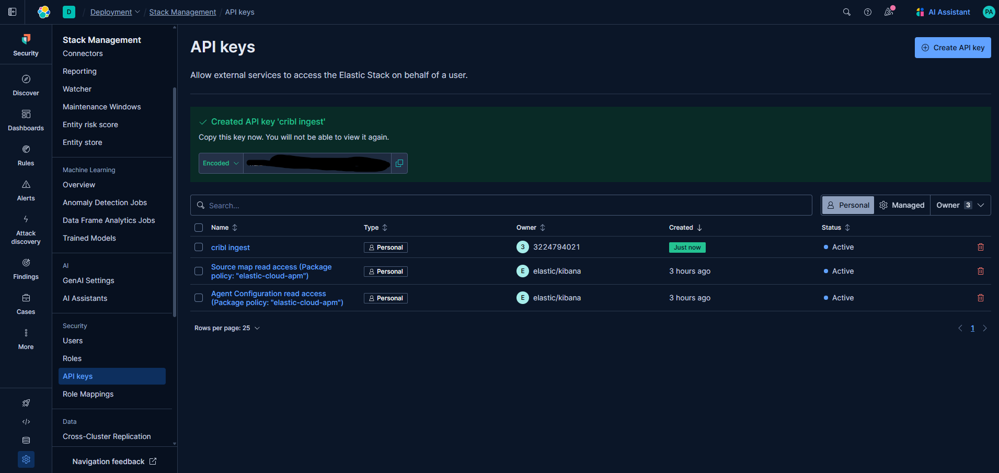
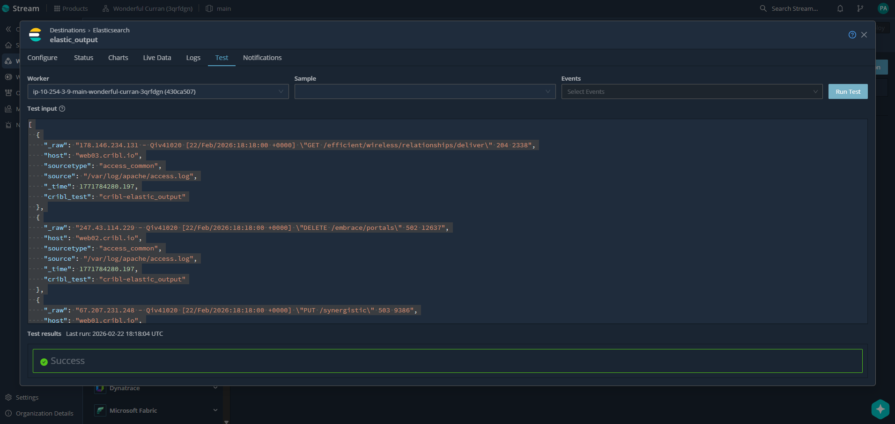
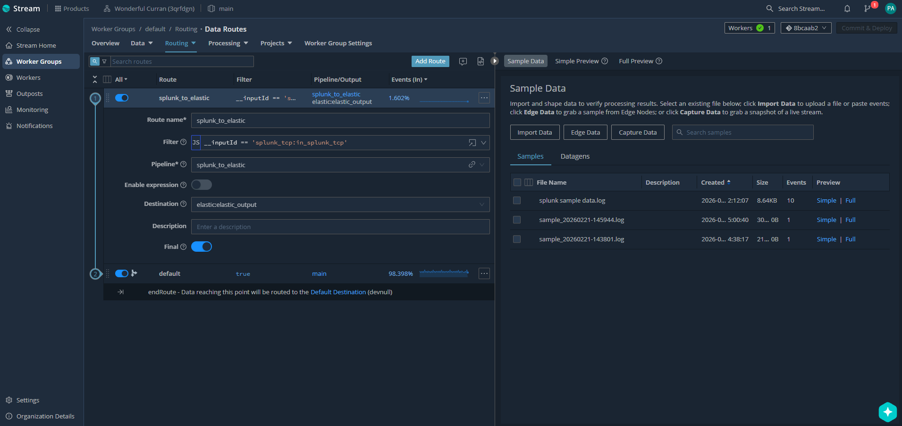
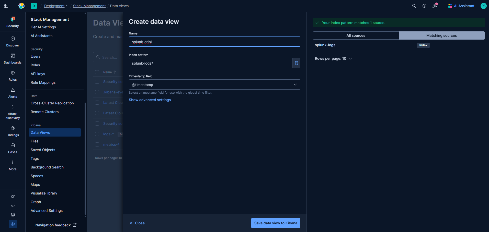
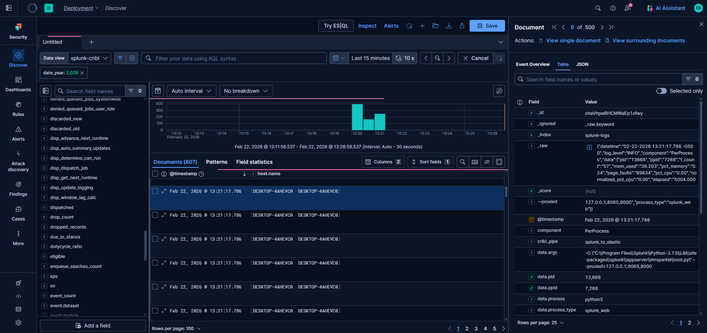

# Splunk to Elastic Pipeline via Cribl Stream

## Project Overview

Configured a Cribl Stream pipeline to ingest logs from a Splunk Enterprise trial instance via TCP forwarding, applying parsing and normalization functions to extract and map fields into ECS-compliant schema before routing the processed data to Elastic Cloud. Validated end-to-end pipeline functionality in Kibana Discover, confirming field extraction accuracy, correct index routing (`splunk-logs`), and Cribl pipeline tagging (`cribl_pipe: splunk_to_elastic`) across 807+ ingested documents.

---

## Tools & Technologies

- Cribl Stream (Cloud)
- Splunk Enterprise (Trial)
- Elastic Cloud + Kibana
- PowerShell
- TCP Forwarding (`outputs.conf`)

---

## Pipeline Architecture
```
Splunk Enterprise → outputs.conf (TCP) → Cribl Stream → ECS Normalization Pipeline → Elastic Cloud → Kibana Validation
```

---

## Step-by-Step Configuration

### Step 1 – Cribl Worker Group Overview
Accessed the Cribl Stream Worker Group dashboard confirming the environment was active with 9 pipelines, 2 routes, and throughput metrics showing 790+ KB in/out over 24 hours. This served as the baseline before beginning source and pipeline configuration.


---

### Step 2 – Cribl Sources Overview
Navigated to Data > Sources within the Worker Group to review all available input types. Confirmed existing configured sources including Splunk TCP (1), Splunk HEC (1), Syslog (2), and TCP (1), providing a clear view of the ingestion landscape before adding new sources.



---

### Step 3 – Splunk TCP Source Configured
Configured a Splunk TCP source (`in_splunk_tcp`) listening on port `9997` at `0.0.0.0`, set to route through the pipeline. Status confirmed as Live and enabled, establishing the receiving endpoint for Splunk forwarder traffic.


---

### Step 4 – Splunk TCP Live Data Capture
Used the Live Data tab on the `in_splunk_tcp` source to capture real-time events flowing from Splunk. Saved the capture as `splunk sample data.log` for use as sample data during pipeline development. Live events confirmed raw Splunk internal metrics logs with fields such as `host`, `source`, `sourcetype`, `index`, and `_time`.


---

### Step 5 – Splunk TCP Throughput Charts
Verified active data flow on the `in_splunk_tcp` source via the Charts tab, showing **6.45k total events in**, **6.24MB total bytes**, and an average throughput of **10.74 eps** — confirming the Splunk forwarder was successfully streaming data into Cribl.



---

### Step 6 – Splunk outputs.conf TCP Forwarding
Configured Splunk's `outputs.conf` to forward all data to Cribl Stream via TCP using a `cribl_group` stanza pointing to the Cribl Cloud ingress address on port `9997`. This redirected Splunk's default indexer output to Cribl as the intermediary processing layer.


---

### Step 7 – Cribl Pipeline Created
Created a new processing pipeline named `splunk_to_elastic` under Processing > Pipelines. This pipeline was built to normalize incoming Splunk events into ECS-compliant field names before forwarding to Elastic Cloud.


---

### Step 8 – Pipeline Field Mapping (Simple Preview)
Built out the Eval function within the `splunk_to_elastic` pipeline, mapping Splunk native fields to ECS-compliant equivalents. The Simple Preview panel confirmed field transformations were applying correctly against the captured sample data, showing 20 mapped fields including `host.name`, `event.dataset`, `source.ip`, `event.action`, and `process.name`.


---

### Step 9 – Pipeline ECS Field Mapping Output Validated
Expanded the pipeline preview to the OUT view, confirming all 33 output fields were present and correctly mapped. Key ECS fields including `cribl_pipe: splunk_to_elastic`, `event.dataset`, `host.name`, `labels.group`, `metric_name`, and `log.file.path` were all visible and populated, validating the normalization logic before deployment.



---

### Step 10 – Elastic API Key Created
Generated a new API key named `cribl-ingest` in Elastic Cloud under Stack Management > API Keys to authenticate Cribl Stream's outbound connection to the Elastic Elasticsearch endpoint.



---

### Step 11 – Elastic API Key Confirmed Active
Confirmed the `cribl-ingest` API key status as **Active** alongside existing managed keys. Copied the encoded key value for use in the Cribl Elasticsearch destination configuration.


---

### Step 12 – Cribl Destinations Overview
Navigated to Data > Destinations within Cribl Stream to review all available output targets. Selected **Elastic Elasticsearch** as the destination type to configure the outbound connection to Elastic Cloud.


---

### Step 13 – Cribl Elastic Destination Configured
Configured the Elasticsearch destination (`elastic_output`) with the Elastic Cloud bulk API URL, index set to `splunk-logs`, and load balancing enabled. This established the delivery endpoint where all processed and normalized events would be forwarded.


---

### Step 14 – Elastic Destination Connection Test Successful
Ran a connection test against the `elastic_output` destination using sample log data. The test returned a **Success** result, confirming Cribl could authenticate and deliver events to the Elastic Cloud endpoint before activating the live route.



---

### Step 15 – Data Route Configured
Created a data route named `splunk_to_elastic` under Routing > Data Routes, associating it with the `splunk_to_elastic` pipeline and `elastic:elastic_output` destination. Route set to **Final** to prevent events from falling through to the default route after processing.


---

### Step 16 – Data Route Active with Input Filtering
Updated the route filter to `__inputId == 'splunk_tcp:in_splunk_tcp'` to scope routing exclusively to events originating from the Splunk TCP source. Confirmed the route was processing **1.602%** of live traffic through the pipeline with the default route handling the remainder.



---

### Step 17 – Elastic Data View Created in Kibana
Created a Kibana Data View named `splunk-cribl` with index pattern `splunk-logs*` and timestamp field set to `@timestamp`. Elastic confirmed the pattern matched **1 source** (`splunk-logs` index), making the data queryable in Kibana Discover.



---

### Step 18 – Kibana Discover Validation
Queried the `splunk-cribl` data view in Kibana Discover, confirming **807 documents** ingested with active histogram activity. Inspected individual documents to verify field accuracy — `cribl_pipe: splunk_to_elastic`, `_index: splunk-logs`, `host.name: DESKTOP-4AHEVC0`, and all ECS-mapped fields present and correctly populated, validating the full end-to-end pipeline.



---

## Results

- Successfully forwarded Splunk Enterprise logs to Cribl Stream via TCP on port 9997
- Built and validated a normalization pipeline mapping Splunk fields to ECS schema with 33 output fields
- Delivered processed events to Elastic Cloud index `splunk-logs` via authenticated Elasticsearch bulk API
- Confirmed 807+ documents ingested and queryable in Kibana Discover with full field fidelity
